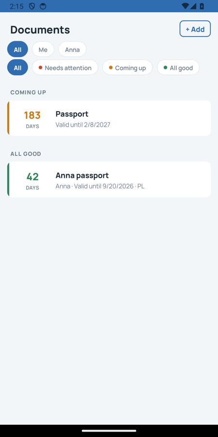
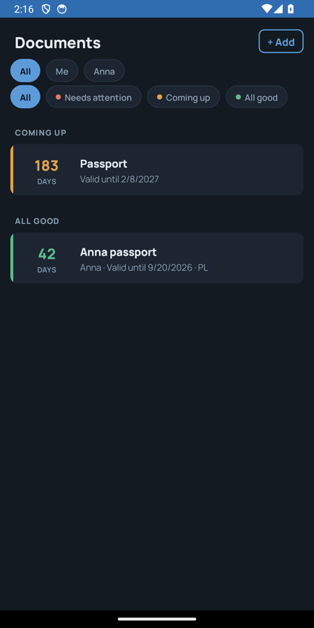
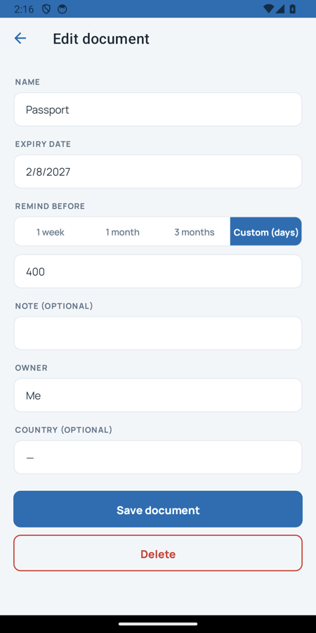

# RenewTheDoc

Cross-platform mobile app (Android / iOS / iPad) that reminds you to renew your documents — IDs, passports, insurances, registrations, anything with an expiry date.

- Add a document in seconds: name, expiry date, "remind before" (presets or custom days), optional note, country, and owner.
- Get a local notification before the document expires; editing a document reschedules its reminder, deleting cancels it.
- Documents belong to **owners** — you by default ("Me"), or anyone from a small dictionary you grow inline ("+ New owner…"): family members, whoever.
- The list triages itself into **Needs attention / Coming up / All good** and filters by owner and status with one tap.
- Localized in English, Polish, and Russian — UI, dates, and notification text.
- Privacy-first: all data stays on the device. No backend, no accounts, no analytics, no INTERNET permission on Android.

Planned later: country-specific renewal guidance, document scans, backup/export. See the fog sections of the completed wayfinder maps.

## Screenshots

<p>
  
  
  
</p>

## Status

Core feature set working on Android and iOS (verified on emulator and simulators). Not yet distributed via stores. Work is planned and tracked as wayfinder maps on [Linear](https://linear.app/renewthedoc/team/REN) — completed so far: Bootstrap, Design, Edit/Delete + Country, Owners.

## Design

"Compass" visual direction: calm-blue light/dark palette, Manrope, urgency-grouped list with a colored rail + days-left number per row, pill filter chips. Design tokens live in `Resources/Styles/Colors.xaml` + `Styles.xaml`; the domain glossary in [CONTEXT.md](CONTEXT.md).

## Stack

.NET MAUI on .NET 10. Solution layout:

- `src/RenewTheDoc.Domain` — domain model (see [CONTEXT.md](CONTEXT.md)), no MAUI dependency
- `src/RenewTheDoc.Application` — application services over the domain
- `src/RenewTheDoc.Persistence` — sqlite-net storage behind `IDocumentRepository`/`IOwnerRepository`
- `src/RenewTheDoc.App` — MAUI app (Android + iOS); notifications via Plugin.LocalNotification behind `IReminderScheduler`
- `tests/RenewTheDoc.Domain.Tests`, `tests/RenewTheDoc.Application.Tests`, `tests/RenewTheDoc.Persistence.Tests` — mirror the source projects

## How it's built

Domain-driven design, sized to the app rather than to the pattern catalogue.

The rules that make this app what it is — when a reminder fires, what makes a document valid, what "Me" means — live in `RenewTheDoc.Domain`, which references no UI framework and no database. `Document` is immutable, can only be built through `Create` or `Restore` (both validating), returns a new instance from `Edit`, and **plans its own reminder**. `Owner` is a separate aggregate, because renaming someone shouldn't ripple through every document that names them.

Use cases live one layer out, in `RenewTheDoc.Application`: add, edit, delete, list, re-plan reminders. Pages call those and do nothing else — before the refactor, "editing a document cancels and re-plans its reminder" was implemented in a page's click handler, which meant the app's headline rule had no test and no home.

Everything the domain needs from the outside world is an interface it owns — `IDocumentRepository`, `IOwnerRepository`, `IReminderScheduler` — implemented further out in `Persistence` and the MAUI head. Dependencies point one way:

```
App  →  Application + Persistence  →  Domain
```

**What was deliberately left out**, so nobody adds it expecting to find company: no MVVM framework, no domain events, no CQRS or unit-of-work, no `Result<T>`, no mediator. Each was considered and rejected at this size — about 2,000 lines of app code against 1,900 of tests — where an application service calling two collaborators is easier to read and test than the indirection that would replace it. The reasoning, including what would justify revisiting each one, is in [docs/architecture/ddd-refactor.md](docs/architecture/ddd-refactor.md).

## Building locally

```sh
dotnet workload install maui
dotnet test tests/RenewTheDoc.Domain.Tests         # and .Application.Tests, .Persistence.Tests
dotnet build src/RenewTheDoc.App -f net10.0-android \
  -p:JavaSdkDirectory=<your JDK 17 home>           # needs JDK 17 + Android SDK
```

A bare `dotnet test` also builds the Android head, so it fails without the JDK path — run the test projects directly. `JavaSdkDirectory` wants the JDK's home directory itself (on macOS that includes `/Contents/Home`); if `ANDROID_HOME` is unset, add `-p:AndroidSdkDirectory=<your SDK path>`.

iOS build requires a Mac with full Xcode (`net10.0-ios` target). For a standalone `adb install` of a debug APK, add `-p:EmbedAssembliesIntoApk=true`.

## License

[MIT](LICENSE)
